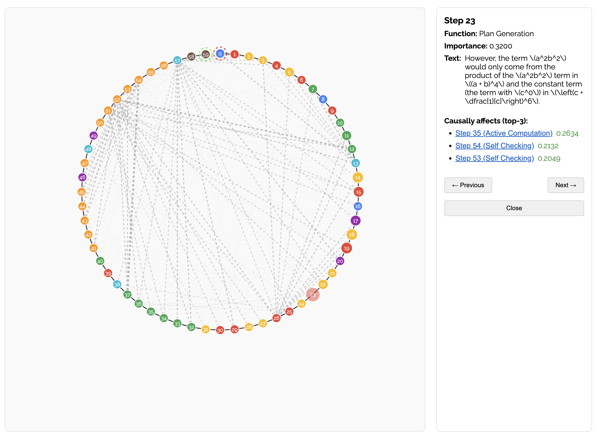

# Principled attribution in multi-step reasoning for thinking models

This repository contains some of the code for our work on principled attribution in multi-step reasoning for thinking models.

Our research focuses on quantifying the causal importance of each sentence in a chain-of-thought, both in terms of its influence on the final answer and on subsequent reasoning steps. We first estimate this through resampling-based interventions, and then explore whether it can be approximated using internal model signals.

You can find a detailed presentation in this topic [here](https://docs.google.com/presentation/d/1dwg9cQ0rhVcSrKjVThPac0M1Piz2TO5HKLqemet0LB8/edit?usp=sharing). You can also find an interactive visualization [here](https://www.uzaymacar.com/research/principled-attribution).

