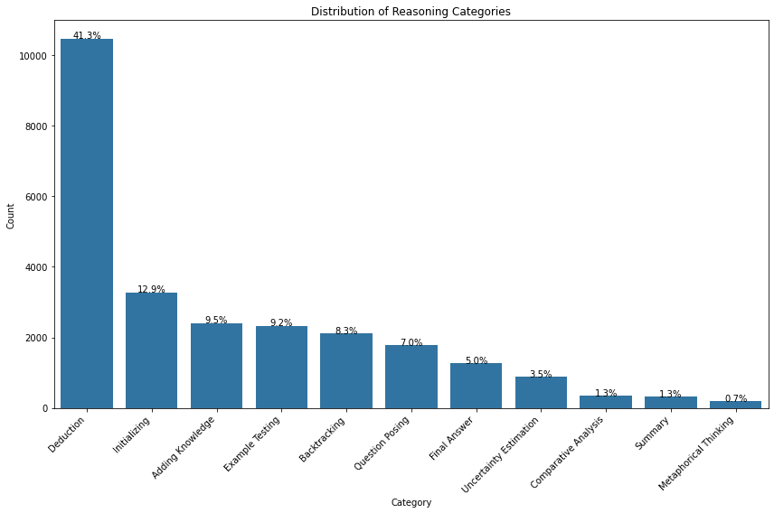
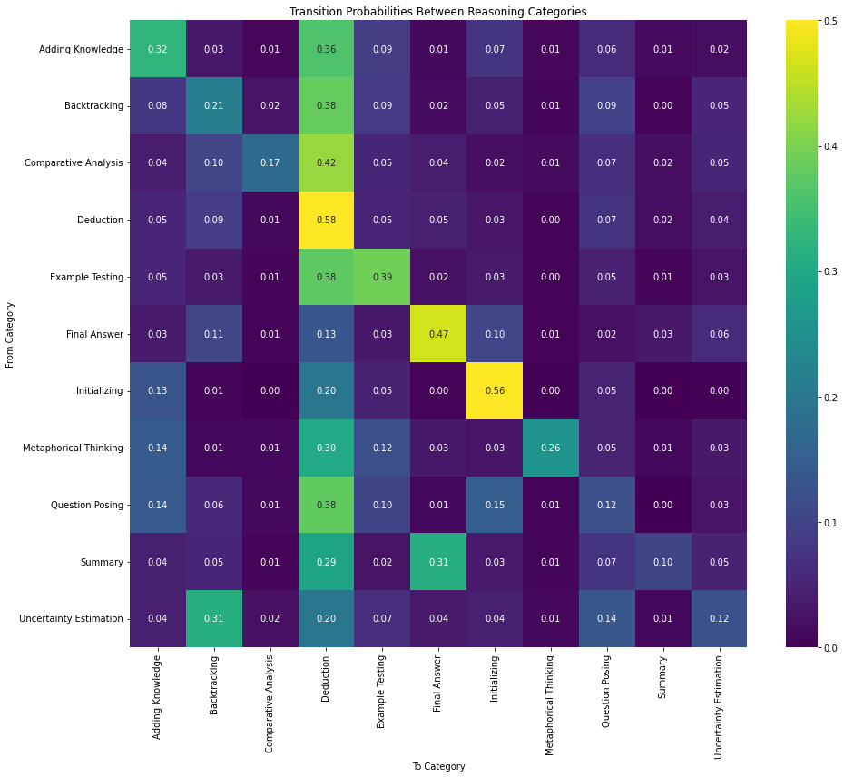
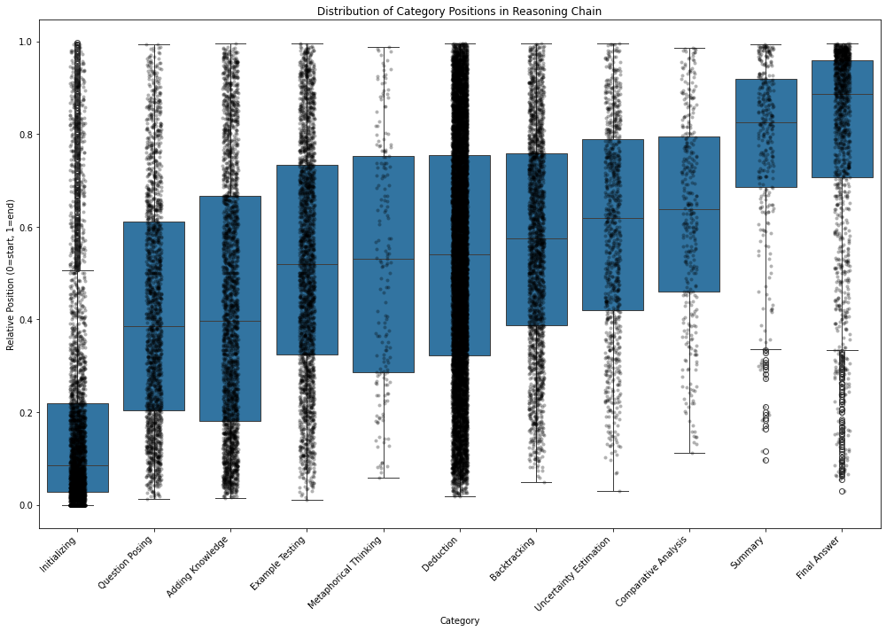
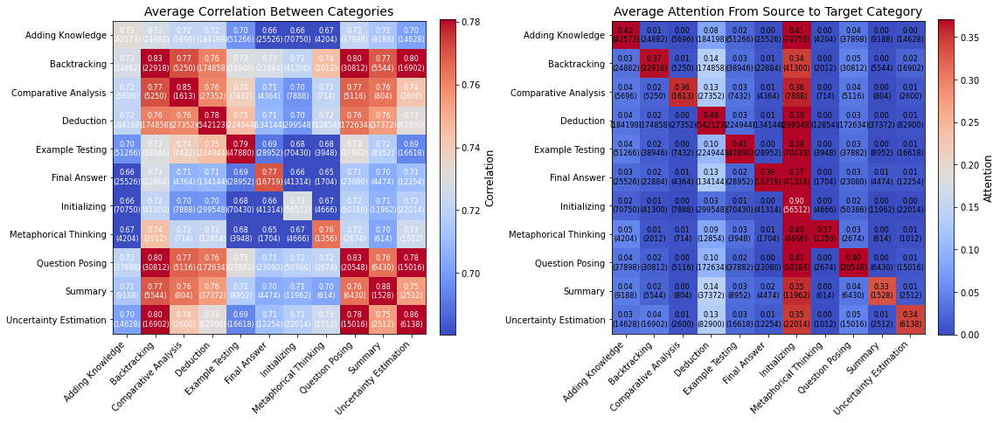
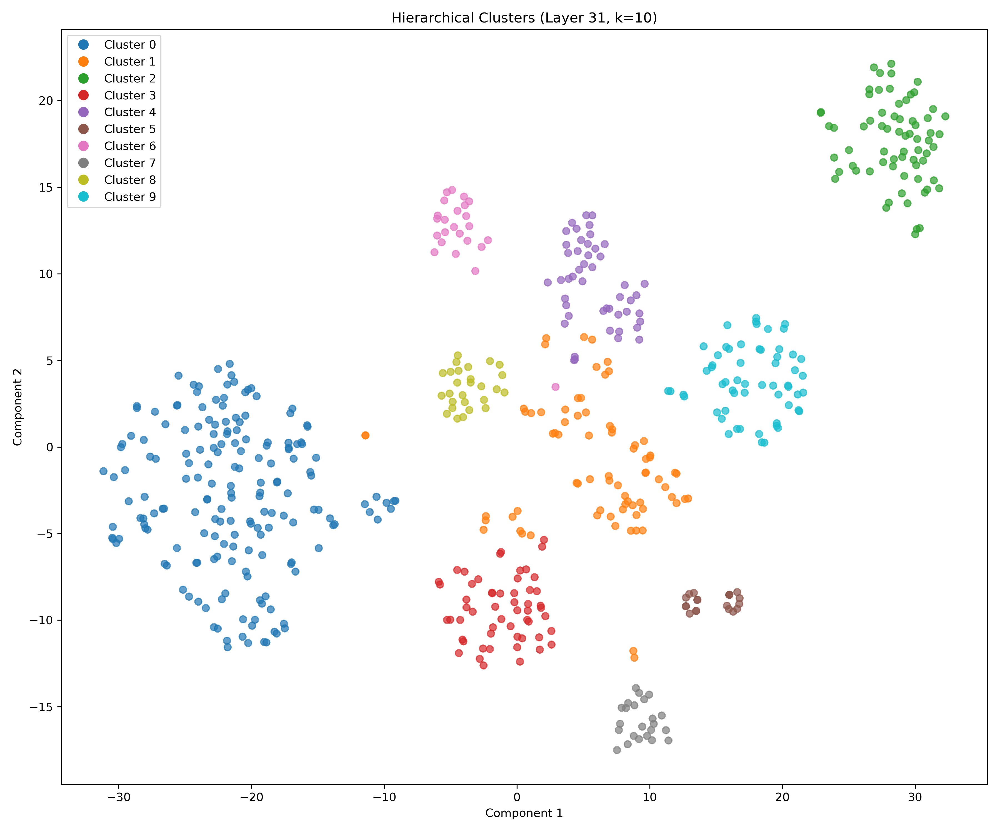
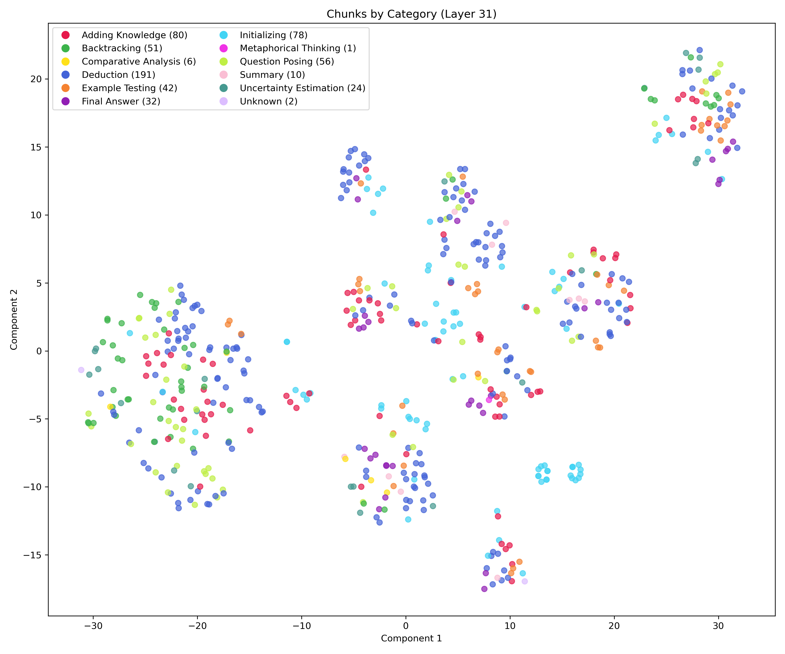
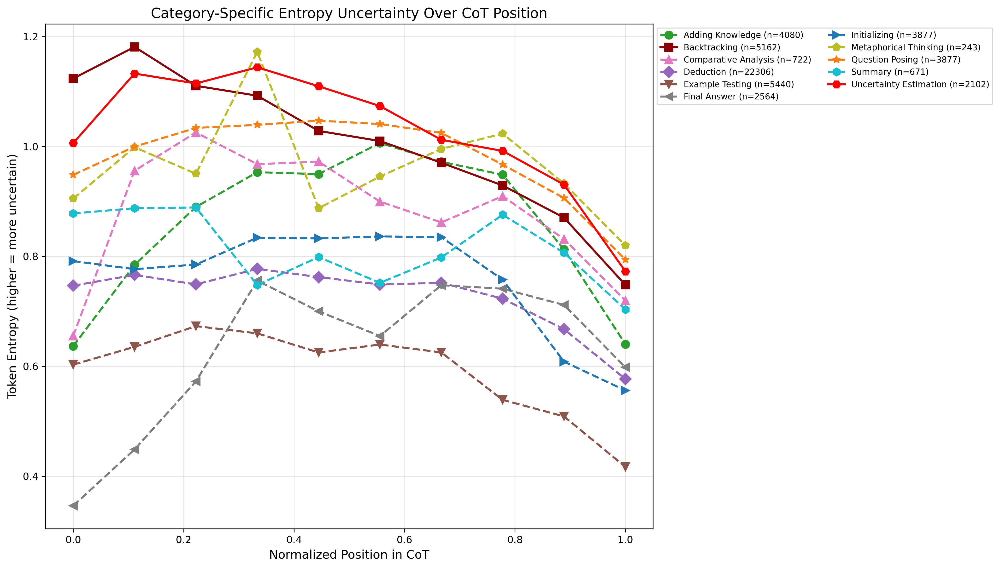
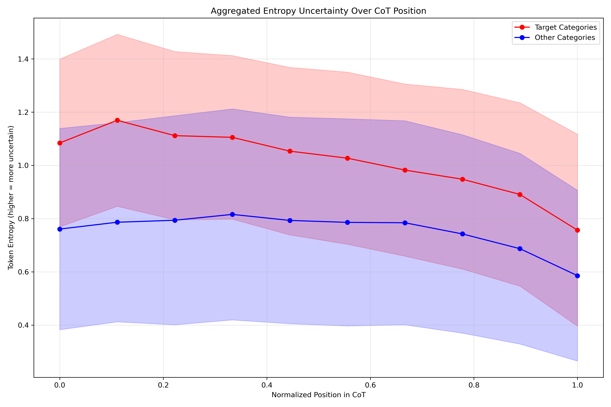
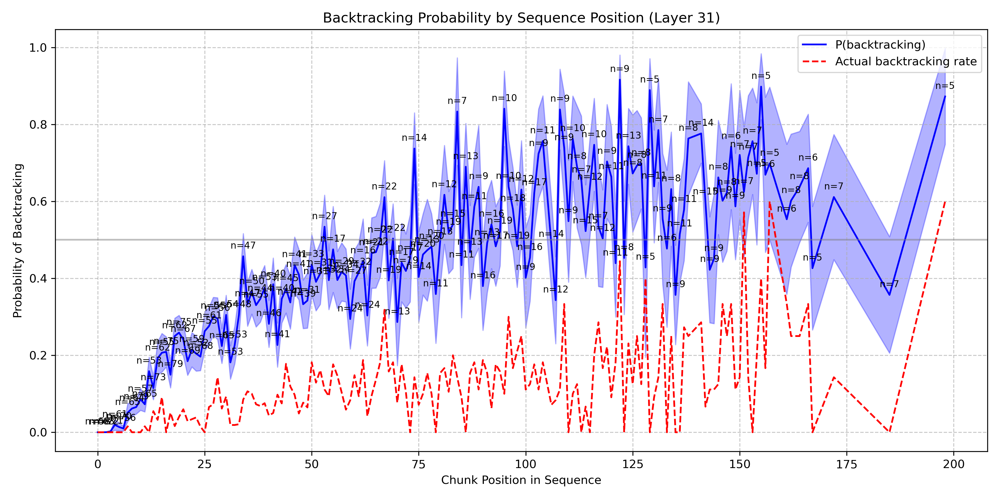

# Mechanistic Interpretability for Reasoning Models

This repository contains several basic analyses and mech-interp experiments on reasoning / thinking models.

We tried to build on top of [Understanding Reasoning in Thinking Language Models via Steering Vectors](https://openreview.net/pdf?id=OwhVWNOBcz).

Most of the experiments are:
1. Performed on [DeepSeek-R1-Distill-Llama-8B](https://huggingface.co/deepseek-ai/DeepSeek-R1-Distill-Llama-8B)
2. Using a synthetic reasoning dataset curated on the [following topics](./topics_subtopics.json), see [`cots/`](./cots/)
3. Using auto-labeled sentences as the atomic unit of analysis, e.g. see [here](./analysis/problem_1/seed_0/chunks.json)
4. Performed on the residual stream activations of the last layer

## Taxonomy for Reasoning Steps in Chain-of-Thought (CoT)

## Transition Probabilities between Reasoning Categories

## Distribution of Relative Category Positions

## Average Correlation and Attention

## Clustering Sentences by Categories

## Uncertainty Estimation Analysis

## Backtracking Probe

